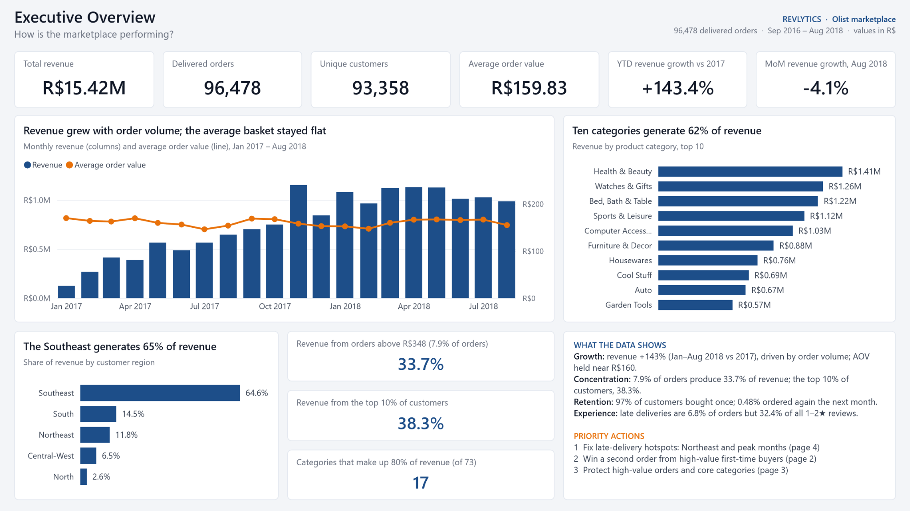
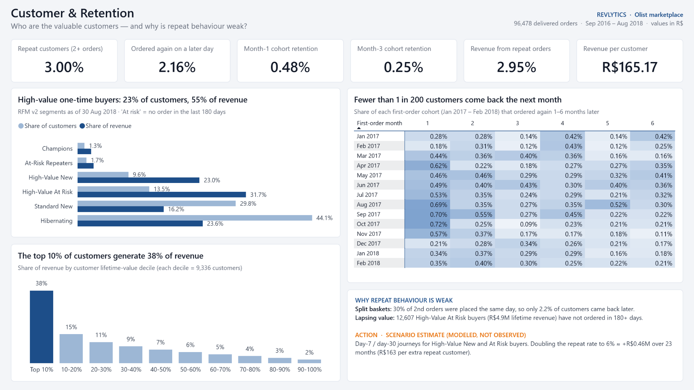
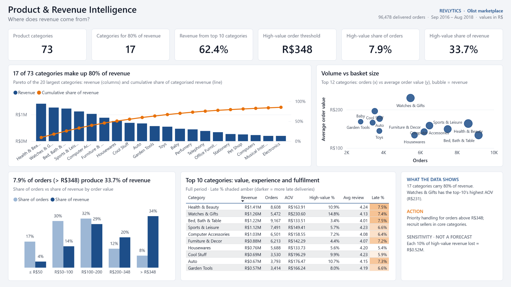
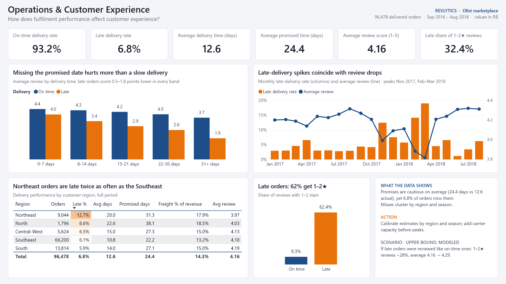

# Revlytics
### Revenue Intelligence & Customer Retention Analytics

An e-commerce analytics case study connecting revenue concentration, repeat purchasing and delivery performance to practical business decisions.

**96,478 delivered orders · 93,358 customers · R$15.42M analyzed · 4 Power BI dashboard pages**

Brazilian Olist marketplace data, September 2016–August 2018. Project stack: Python, pandas, PostgreSQL, Power BI and DAX.

> **Publication status:** This package contains the dashboard showcase and case-study summary. The Python/SQL source, validation exports and Power BI `.pbix` are not included in this publication yet. The latest project handover reports Python–DAX reconciliation complete; PostgreSQL execution remains pending.

## Executive overview

## The business question

Where should a marketplace focus its next improvement effort: customer retention, high-value orders, category selection or delivery reliability?

Revlytics brings these questions into one four-page business review. It examines the scale of each issue, identifies customer and operational segments worth investigating, and turns the findings into testable recommendations.

## Three findings that shape the priorities

| Finding | Evidence shown in the dashboard | Proposed decision |
|---|---|---|
| Revenue is concentrated in a small share of orders | Orders above approximately R$348 represent **7.9% of orders and 33.7% of revenue** | Pilot proactive tracking and exception handling for high-value orders; measure the cost of service against results |
| Repeat purchasing is limited within the observation window | **3.00%** of customers placed at least two orders; **2.16%** ordered again on a later day | Test follow-up journeys for high-value first-time buyers and win-back offers for lapsed customers |
| Late deliveries are disproportionately associated with poor reviews | **6.8%** late-delivery rate; late orders account for **32.4% of 1–2-star reviews** | Investigate regional and peak-period delay hotspots, then test targeted delivery improvements |

These are observational findings. They do not establish that a proposed intervention caused, or will cause, a revenue or review-score improvement.

## Explore the dashboard

### 1. Executive overview

The opening page combines revenue, orders, customers, average order value, growth, geographic mix and concentration. It gives a decision-maker a short list of areas to investigate next.

### 2. Customer & retention

- Separates customers with multiple orders from customers who returned on a later day.
- Compares RFM segment shares of customers and revenue.
- Shows monthly cohorts and customer-value concentration.
- Identifies **12,607 high-value at-risk buyers**, with approximately **R$4.9M in historical revenue**, who had not ordered in at least 180 days at the analysis snapshot.

Historical revenue describes the segment's past value; it is not an amount guaranteed to be recovered.

### 3. Product & revenue intelligence

- **17 of 73 categories** reach 80% of categorized revenue.
- The top 10 categories contribute **62.4%** of revenue.
- Category comparisons combine order volume, average order value, review scores and late-delivery rates.
- High-value orders are shown separately to support service-priority decisions.

### 4. Operations & customer experience

- Compares late and on-time orders within delivery-duration bands.
- Tracks monthly late-delivery rates alongside average review scores.
- Shows regional differences: the Northeast has a **12.7%** late rate versus **6.1%** in the Southeast.
- **62.4% of reviewed late orders** received 1–2 stars, compared with **9.3% of reviewed on-time orders**.

## KPI reference

| KPI | Reported value | Reading the metric |
|---|---:|---|
| Revenue analyzed | R$15,419,773.75 | Project revenue measure for the delivered-order scope; not marketplace profit or platform commission revenue |
| Delivered orders | 96,478 | Order-level scope of the analysis |
| Unique customers | 93,358 | Distinct customer identities across the delivered orders |
| Average order value | R$159.83 | Revenue analyzed divided by delivered orders |
| Repeat-customer rate | 3.00% | Customers with at least two orders divided by unique customers; same-day orders are included |
| Later-day repeat-customer rate | 2.16% | Customers who ordered on more than one calendar day divided by unique customers |
| High-value order threshold | Approximately R$348 | Display-rounded threshold; the project handover reports R$347.88 |
| High-value share of revenue | 33.7% | Revenue from orders above the high-value threshold divided by total analyzed revenue |
| Late-delivery rate | 6.8% | Deliveries after the estimated delivery date; missing delivery dates are excluded from timing classification |
| Late share of negative reviews | 32.4% | Late orders with 1–2-star reviews as a share of all 1–2-star reviews |
| Average review score | 4.16 / 5 | Based on available reviews; missing reviews are not imputed |

The customer dashboard displays corrected Month-1 retention of **0.48%** and Month-3 retention of **0.25%**. Reproducing those headline aggregates requires the source KPI specification, including eligible cohorts, observation windows and aggregation rules. The older 5.45% Month-1 figure was withdrawn in the project handover.

## From findings to experiments

| Priority | Proposed test | Primary measure | Guardrail |
|---|---|---|---|
| 1 — Delivery reliability | Target delay hotspots by region and peak period; calibrate delivery promises and capacity | Late-delivery rate | Shipping cost, delivery time and conversion |
| 2 — Second purchase | Test Day-7/Day-30 follow-up journeys for high-value first-time buyers | Incremental later-day repeat rate against a control group | Discount cost, unsubscribes and contribution margin |
| 3 — High-value service | Pilot proactive tracking and faster exception handling | Delivery reliability and review outcomes for high-value orders | Incremental service cost |
| 4 — Win-back | Test outreach to high-value customers inactive for 180+ days | Incremental reactivation against a control group | Incentive cost and margin |

These are proposed experiments, not completed business interventions. No realized revenue uplift is claimed.

Scenario callouts in the screenshots are explicitly modeled. For example, approximately R$0.46M from doubling the repeat rate is a hypothetical estimate over 23 months, not annual recurring revenue or achieved impact. The R$0.52M high-value revenue sensitivity is likewise a what-if calculation.

## Analytical workflow

The project handover describes the following implementation:

1. Integrate nine Olist CSV datasets with Python and pandas.
2. Build an order-grain analytical table and a star schema for reporting.
3. Analyze cohorts, customer RFM segments, category Pareto concentration and fulfillment patterns.
4. Implement Power BI measures in DAX and compare outputs with pandas.
5. Present findings across four dashboard pages and prioritize experiments.
6. Execute the PostgreSQL warehouse and complete SQL–pandas–DAX reconciliation; this final step is pending in the available handover.

Reported data-quality corrections include deterministic review selection, preserving missing delivery dates and reviews, and fixing frequency scoring that had incorrectly classified one-time buyers as loyal customers.

## Available files and validation status

| Artifact or check | Status in this publication |
|---|---|
| Four dashboard screenshots | Included under `dashboard/screenshots/` |
| Case-study README | Included |
| Python–DAX comparison | Latest handover reports 38 dashboard KPIs with zero mismatches; validation exports not included here |
| PostgreSQL execution and three-way reconciliation | Pending in the latest handover |
| Python scripts, SQL, notebooks and processed data | Not included in this package |
| Interactive Power BI `.pbix` / source project | Reported in the handover, but not included in this package |

Open the screenshot images to inspect the report at full resolution. They are static previews; interactive filtering and source-level reproduction require the project files listed above.

## Scope and limitations

- This is an independent portfolio analysis of a historical public dataset, not a live deployment at Olist or Meesho.
- The delivered-order scope does not describe the complete cancellation, return or acquisition funnel.
- Repeat behavior is limited to observable purchases in this dataset; it does not capture every purchase a customer made elsewhere.
- Later cohorts have shorter follow-up periods, so retention comparisons require consistent eligibility rules.
- Same-day additional orders are not treated as evidence of a later-day return.
- Delivery and review relationships are associations, not causal estimates. Missing reviews and dates need explicit denominator handling.
- Costs and margins are not established here. Revenue concentration alone cannot demonstrate profitability or ROI.

## Data attribution

Source: [Brazilian E-Commerce Public Dataset by Olist](https://www.kaggle.com/datasets/olistbr/brazilian-ecommerce).

Dataset attribution and license reference supplied with the project: [CC BY-NC-SA 4.0](https://creativecommons.org/licenses/by-nc-sa/4.0/). The source dataset is not redistributed in this package.

Project author: [Dev Pratap Singh](https://github.com/DevPS326).
